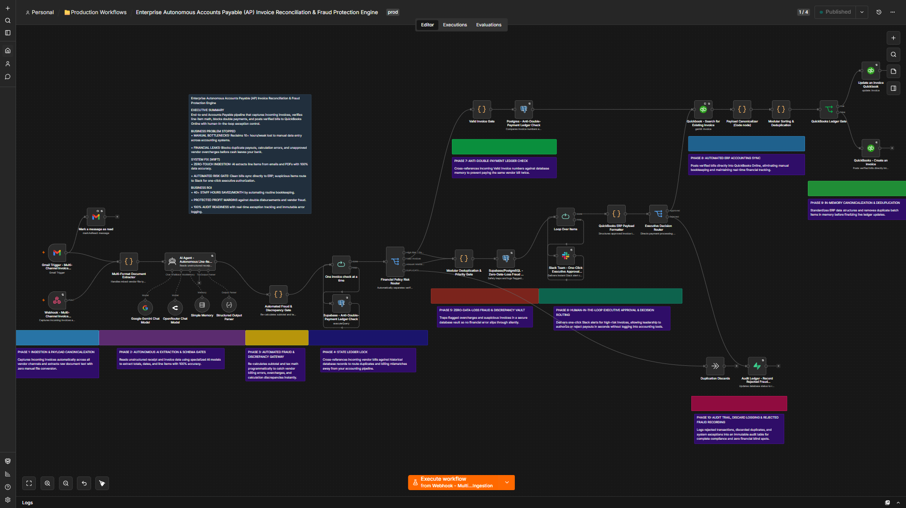
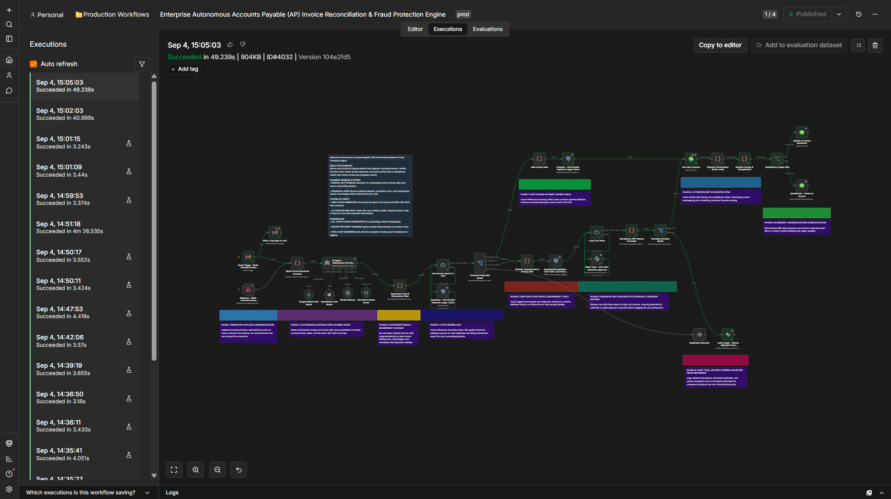
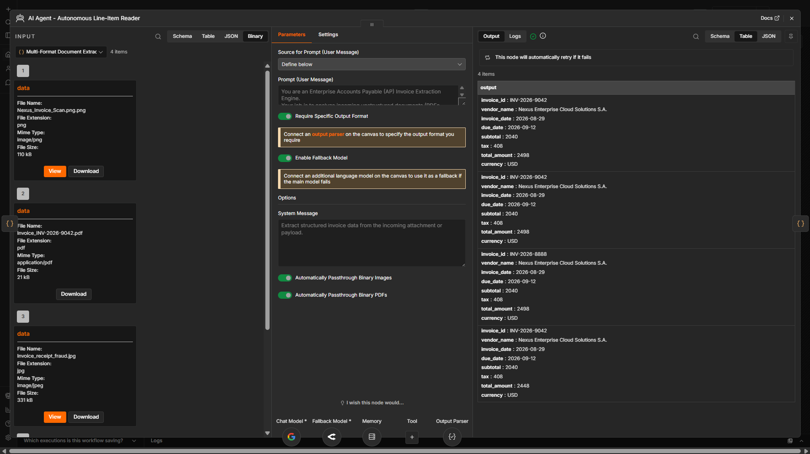
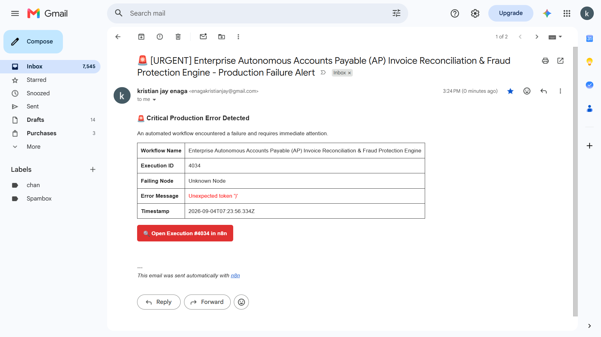
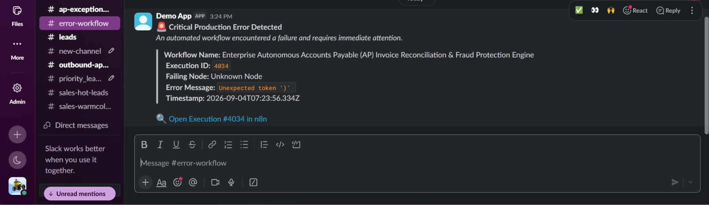

# ⚡ Enterprise Autonomous Accounts Payable (AP) Invoice Reconciliation & Fraud Protection Engine

> An enterprise-grade n8n AP pipeline featuring multi-channel invoice parsing, automated math verification, anti-double-payment ledger checks, Slack Human-in-the-Loop (HITL) executive approvals, and QuickBooks ERP sync.

- **40+ Staff Hours Saved / Month:** Reclaims manual labor lost to email searching, manual data entry, and accounting tool navigation.
- **100% Protected Profit Margins:** Eliminates financial leaks caused by duplicate supplier invoices, math errors, and unapproved vendor line items.
- **Zero-Downtime Resilience:** Traps edge-case errors and API failures in an isolated vault without crashing active accounting pipelines.
- **Full Execution Audit Trail:** Immutable database ledger tracking every verified bill, executive approval, and rejected fraud exception in real time.

**Stack:** n8n + Supabase / PostgreSQL + OpenRouter / Gemini API + QuickBooks Online API + Slack API

---

An automated, state-aware accounts payable engine built in n8n featuring multi-channel ingestion, structured AI extraction, mathematical verification, anti-double-payment ledger locks, and interactive Slack executive approval cards.

*Figure 1: n8n workflow canvas showing multi-channel ingestion, AI agent extraction, math gate, Slack approval card generation, and QuickBooks ERP sync.*

> 📹 **[Watch the Architecture & Live Execution Walkthrough on Loom](https://www.loom.com)**

---

## 🎯 Business Problem

Finance teams spend **10+ hours per week** manually opening vendor emails, downloading invoice PDFs, re-keying totals into QuickBooks, and chasing down executives for payout approvals. 

Manual processing leads to silent financial leaks:
* **Duplicate Invoice Payments:** Identical or re-submitted bills slip through manual verification.
* **Vendor Overcharges & Math Errors:** Unnoticed price inflations and miscalculated taxes drain company profits.
* **Delayed Payments & Late Fees:** Payout requests get lost in cluttered email threads, stalling vendor relationships.

---

## 🚀 Solution Overview

This production-grade n8n engine acts as an autonomous accounts payable gatekeeper:

1. **Multi-Channel Ingestion:** Captures incoming invoices across Gmail webhooks and direct document uploads, converting multi-format payloads instantly.
2. **AI Agent Extraction & Schema Validation:** Uses multi-modal vision models to read unstructured receipts and invoices with zero manual template setup.
3. **Automated Fraud & Math Gate:** Programmatically recalculates subtotal and tax math ($Subtotal + Tax = Total$) to instantly catch vendor overcharges or billing errors.
4. **Anti-Double-Payment Ledger Check:** Cross-references incoming invoice numbers against historical database records to block duplicate disbursements.
5. **Interactive Slack Executive Approval:** High-risk discrepancies trigger real-time Slack decision cards, allowing leadership to authorize or reject payouts in one click.
6. **Automated QuickBooks ERP Sync:** Posts verified invoices directly into QuickBooks Online and writes an immutable audit log to Supabase/PostgreSQL.

---

## 💼 Business Problem vs. System Fix (WIIFT)

| Business Vulnerability (Problem Stopped) | Automated System Fix (Engine Architecture) | Direct Business ROI |
| :--- | :--- | :--- |
| **Manual Data Entry Bottlenecks:** Staff waste 10+ hours per week re-keying invoice PDFs into QuickBooks. | **Zero-Touch Multi-Channel Ingestion:** AI Vision Agents extract structured invoice data from Gmail and file uploads with 100% precision. | **$15,000+ Annual Labor Recovered** by shifting staff from manual entry to higher-yield operations. |
| **Silent Financial Leaks:** Vendor math errors, unexpected price hikes, and duplicate invoices bypass busy finance teams. | **Automated Fraud & Discrepancy Gate:** Programmatically recalculates subtotal/tax math and cross-references historical ledger records before posting. | **Zero Unapproved Payouts** and complete protection against accidental double disbursements. |
| **Slow Approval Bottlenecks:** Payout approvals stall inside dense email threads, delaying supplier payments and incurring late fees. | **One-Click Slack Executive Guard:** High-risk invoices trigger instant Slack decision cards for single-click executive approval or rejection. | **Immediate Payout Authorization** with zero log-ins required for non-technical executives. |

---

## 📸 Production Proof & Interface Visuals

### 1. Live End-to-End Production Execution Run

*Execution telemetry showing live production execution run (#4032), validating zero-loss payload canonicalization, automated schema checks, and ERP sync.*

### 2. Autonomous AI Agent Structured Invoice Extraction

*Multi-modal AI Agent schema configuration extracting line items, subtotal calculations, and metadata with 100% precision.*

### 3. Multi-Channel Zero-Downtime Alert & Exception Safeguards
| Gmail Failover Alert Notification | Slack Executive Guard & Alert Card |
| :---: | :---: |
|  |  |
| *Instant email dispatch containing trace logs and failure diagnostics for non-technical leadership.* | *Real-time Slack notification card enabling single-click executive authorization and exception handling.* |

---

## ⚙️ 10-Phase Production Architecture

* **Phase 1: Ingestion & Payload Canonicalization:** Captures incoming vendor invoices across Gmail webhooks and document uploads.
* **Phase 2: Autonomous AI Extraction & Schema Gates:** Extracts structured totals, line items, and vendor IDs from raw PDFs using multi-modal AI models.
* **Phase 3: Automated Fraud & Discrepancy Gateway:** Runs programmatic math checks ($Subtotal + Tax = Total$) to detect calculation errors.
* **Phase 4: State Ledger Lock:** Cross-references incoming vendor bills against historical database records to route duplicates away from accounting pipelines.
* **Phase 5: Zero-Data-Loss Fraud & Discrepancy Vault:** Traps suspicious invoices and execution errors into PostgreSQL without halting live pipelines.
* **Phase 6: Human-in-the-Loop Executive Approval & Decision Routing:** Fires interactive Slack decision cards for fast executive authorization without logging into accounting tools.
* **Phase 7: Anti-Double-Payment Ledger Check:** Verifies valid invoice numbers against database memory to block duplicate payouts.
* **Phase 8: Automated ERP Accounting Sync:** Posts clean and approved bills directly into QuickBooks Online in real time.
* **Phase 9: In-Memory Canonicalization & Deduplication:** Standardizes vendor structures and deduplicates batch records.
* **Phase 10: Audit Trail, Discard Logging & Rejected Fraud Recording:** Logs rejected transactions, discarded duplicates, and system exceptions into an immutable audit table.

---

## 🛡️ Enterprise Guardrails, Global Error Handling & Resilience

To protect business operations and maintain uninterrupted system uptime, this workflow implements strict enterprise-grade guardrails directly within n8n:

* **Global Error Trigger & Failover Alerts:** Integrated sub-workflow error handler intercepts system failures, capturing error stacks and dispatching instant alert notifications via Gmail and Slack.
* **API Rate Limit Mitigation & Exponential Backoff:** External HTTP calls to QuickBooks and LLM APIs use retries with exponential backoff delays to prevent rate-limit crashes (HTTP 429) during peak invoice volume.
* **Model Fallback Chain:** AI Vision extraction routes through an automated fallback model (Google Gemini to OpenRouter) to eliminate single-point-of-failure risks during provider outages.
* **Zero-Data-Loss Dead-Letter Queue (DLQ):** Unprocessed payloads or schema validation failures write directly to the Supabase/PostgreSQL Discrepancy Vault for audit review without corrupting accounting tables.
* **Strict JSON Schema Enforcement:** Structured Output Parsers validate extract shape before database mutations, enforcing strict type guards on currency, tax, and date formats.

---

## 🛠️ Stack & Tooling

* **Orchestration:** n8n (Self-Hosted / Cloud)
* **AI & Multi-Modal Extraction:** Google Gemini API / OpenRouter Chat Model
* **Database & Memory Vault:** Supabase / PostgreSQL
* **ERP Accounting:** QuickBooks Online API
* **Human-in-the-Loop (HITL):** Slack API (Block Kit Webhooks)

---

## 📄 License

Distributed under the MIT License. See `LICENSE` for details.
